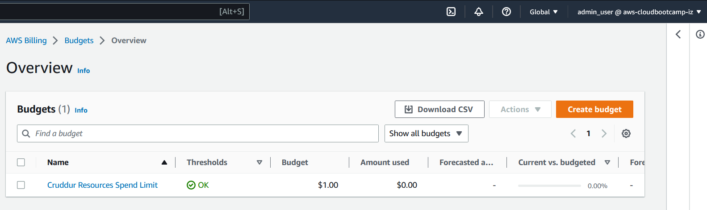
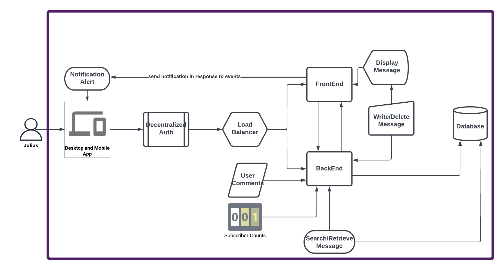
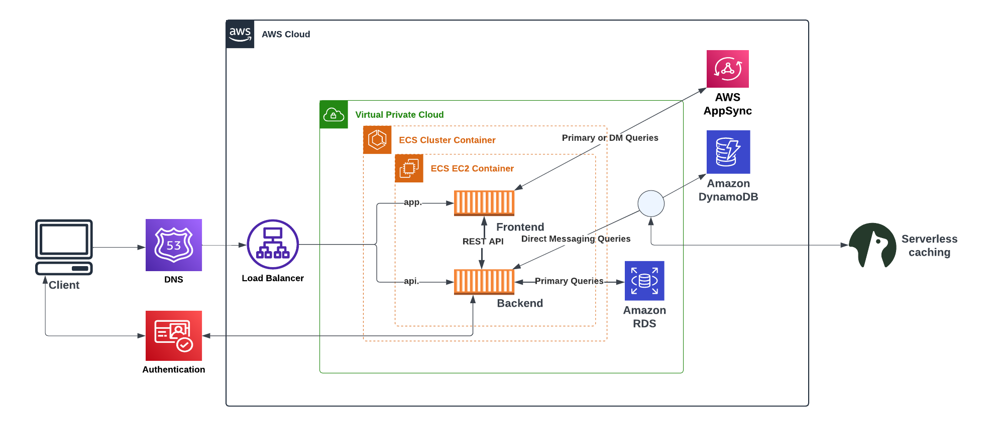
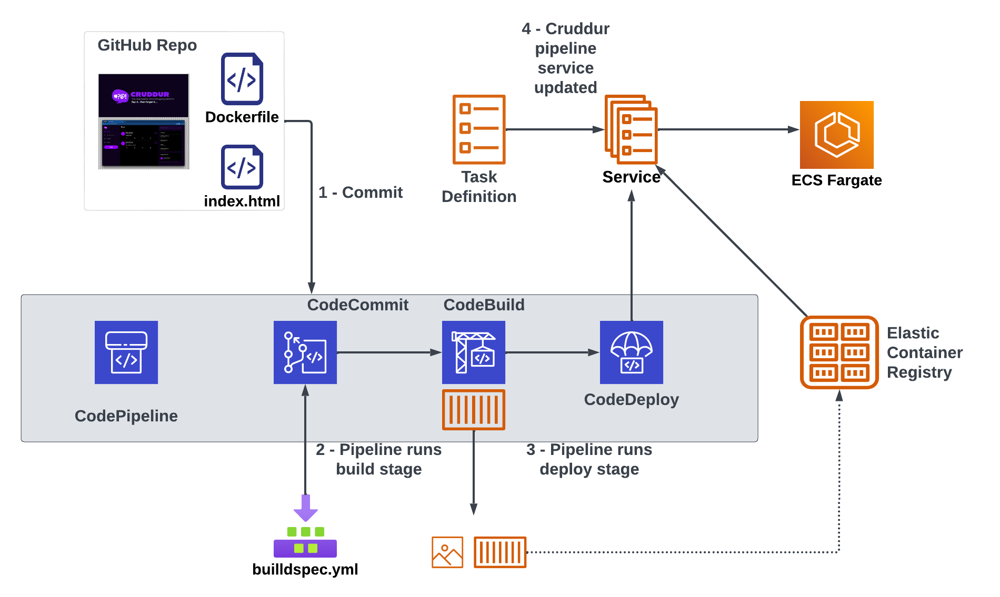

# Week 0 — Billing and Architecture

### Create a budget
I created a budget and limit resource spend to 1$ because I was concerned about exceeding this 1$ limit

### Conceptual(Napkin) Diagram
This is the napkin model/diagram of the cruddur app that will be shown to stakeholders

[Lucid Chart Link of Napkin Design](https://lucid.app/lucidchart/40343493-1465-4448-80fb-9b62bcb1a506/edit?viewport_loc=-901%2C-33%2C2560%2C1224%2C0_0&invitationId=inv_cf96987b-a161-428e-8b58-491ea9c92e18)

### Logical Diagram
The logical diagram of Cruddur

[Lucid Chart Link of Logical Diagram](https://lucid.app/lucidchart/dbf080ae-c430-4901-bde9-311872464e1f/edit?viewport_loc=-199%2C-194%2C2560%2C1224%2C0_0&invitationId=inv_6f23e13c-8008-4b7c-a08e-1b8df007e7a6)

### The CI/CD Pipeline Diagram

[Lucid Chart Link of CI/CD pipeline Diagram](https://lucid.app/lucidchart/55b7c3b2-35c4-4061-b8cf-ad8b25fbdb39/edit?viewport_loc=-871%2C-412%2C3322%2C1588%2C0_0&invitationId=inv_6cc1c7f7-4d01-4cbe-85a5-b34977ecbf0c)